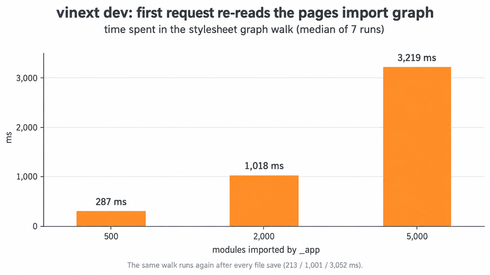

# vinext Pages Router dev: the first request re-reads the whole pages import graph

**In dev, vinext 1.0.0 reads, parses and resolves every module that `_app` and the pages import, to find their stylesheets.**
Vite transforms the same modules for the request and records their imports in its module graph.
With 5,000 modules the walk takes 3.2 s of the first request. It runs again after each saved script or stylesheet.



## Repro

```sh
npm i
npm run measure                  # about 10 minutes
npm run measure -- --runs 3 --sizes 2000 --profile   # also writes a CPU profile to profiles/
```

`measure` generates the app at each size and starts a fresh dev server per run. It requests `/`, saves a component, and requests `/` again.

To look at it by hand:

```sh
npm run generate -- 5000
npm run dev                      # open / and watch the first request
```

## The app

[`scripts/generate.mjs`](scripts/generate.mjs) writes `pages/_app.jsx`, which imports a tree of `components/m*.jsx` (8 imports per module). Every 4th component imports a CSS module. `pages/index.jsx` renders one heading.

## Numbers

Median of 7 runs. Each run starts a new dev server with a warm `node_modules/.vite`.

| modules | files read by the walk | walk, first request | walk, after a file save | first HTML | first HTML without the walk |
|---:|---:|---:|---:|---:|---:|
| 500 | 502 | 287 ms | 213 ms | 1,970 ms | 1,713 ms |
| 2,000 | 2,002 | 1,018 ms | 1,001 ms | 7,664 ms | 5,588 ms |
| 5,000 | 5,002 | 3,219 ms | 3,052 ms | 17,899 ms | 14,395 ms |

- **walk**: wall time of the `load` hook for `virtual:vinext-pages-client-assets`, which runs the walk.
- **files read**: `fs.readFileSync` calls made from `collectModuleDependencies`.
- **without the walk**: the same `load` hook returns the metadata without `ssrManifest`. This is only an experiment to size the cost. In this app the HTML then has the same stylesheet links in the same order.

A CPU profile of the first request (`--profile`, 5,000 modules) shows 1,518 ms of synchronous work under `collectModuleDependencies`:

| what | ms |
|---|---:|
| `fs.readFileSync` | 1,013 |
| `parseAst` | 166 |
| `resolve` and other | 339 |

The rest of the walk's wall time is spent waiting for `this.resolve`.

A large Pages Router app (~4,300 server modules) shows the same pattern. A CPU profile of its first dev request attributes 6.8 s of `readFileSync` and about 3 s of `parseAst` to this walk.

## Cause

The dev `load` hook for [`virtual:vinext-pages-client-assets`](https://github.com/cloudflare/vinext/blob/ca67493fb4f4599dedd55b10e56808424371de6a/packages/vinext/src/index.ts#L4657-L4692) walks `_app` and every page with [`collectDevPagesAppStylesheetAssets`](https://github.com/cloudflare/vinext/blob/ca67493fb4f4599dedd55b10e56808424371de6a/packages/vinext/src/index.ts#L686-L768). For each module it:

1. checks the file with `fs.existsSync`
2. reads it with `fs.readFileSync`
3. parses it with `parseAst`
4. resolves each import with `this.resolve`

The cache from `createModuleDependencyCache` lives only for one `load` call. It shares work between pages, not between loads.

The [`hotUpdate` hook](https://github.com/cloudflare/vinext/blob/ca67493fb4f4599dedd55b10e56808424371de6a/packages/vinext/src/index.ts#L5412-L5422) invalidates the virtual module when `_app`, any stylesheet, or any script under the root changes (outside `node_modules` and `app/`). The next request walks the whole graph again.

For the same request, [`collectPagesDevInitialStylesheetHeadHTML`](https://github.com/cloudflare/vinext/blob/ca67493fb4f4599dedd55b10e56808424371de6a/packages/vinext/src/server/pages-dev-stylesheets.ts#L239-L250) also walks Vite's client module graph (`collectTransformedStylesheetAssets`) and merges both lists. The code is unchanged on `main` (`48c00aa`).

## Environment

vinext 1.0.0, vite 8.3.0, rolldown 1.2.12, react 19.2.8, Node 24.13.0, macOS 26.6, Apple M1 Max.
Other processes ran on the machine during the runs (load average 7 to 65), so absolute times are noisy. The number of files read is the same in every run.
